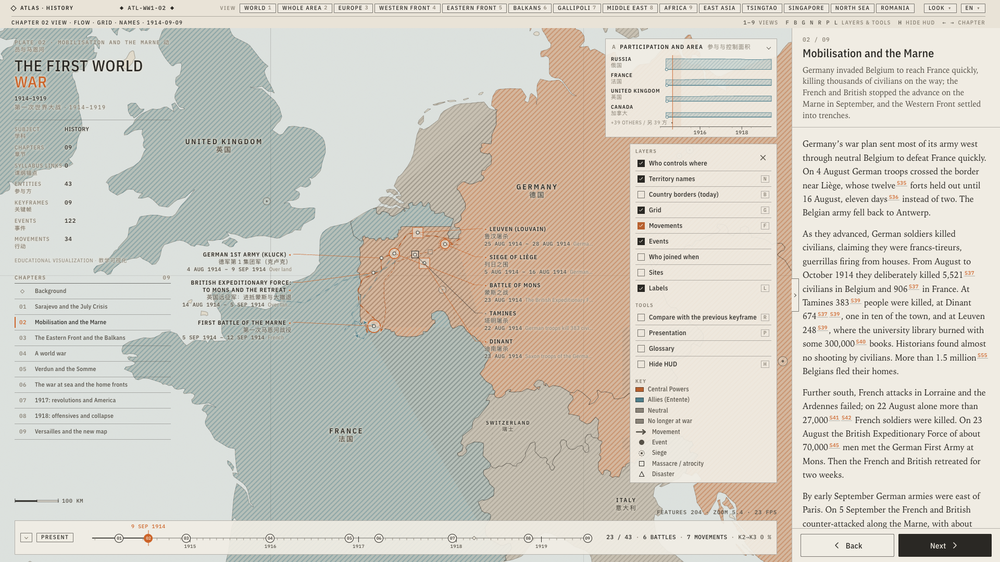
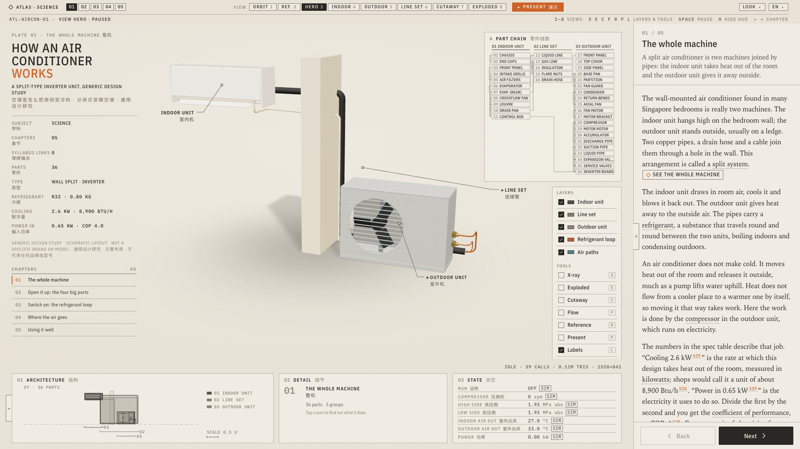
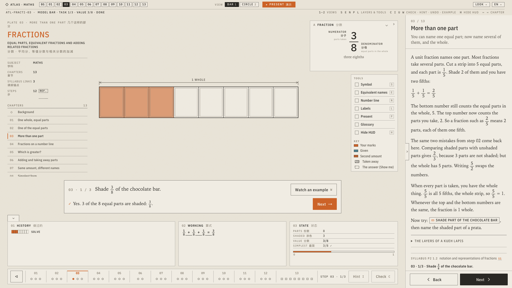
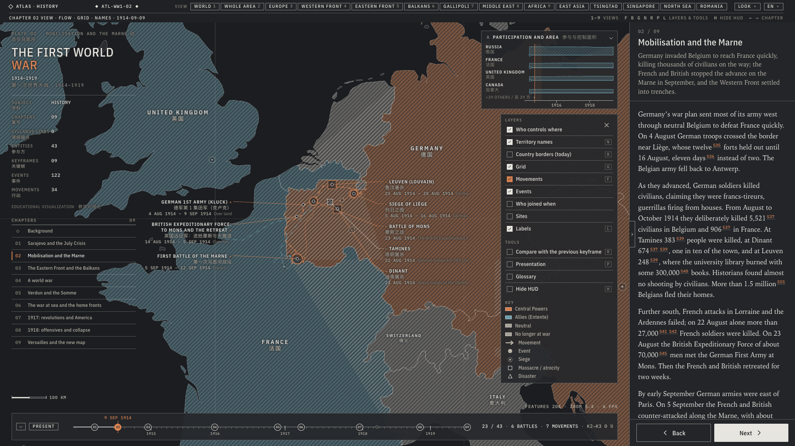
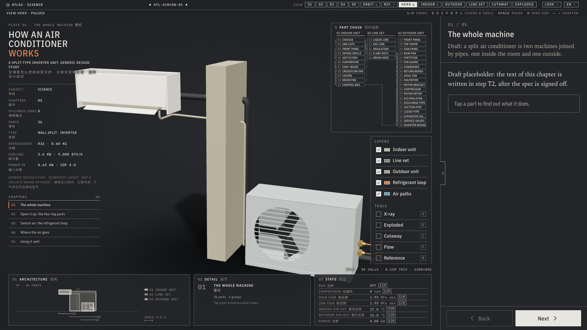
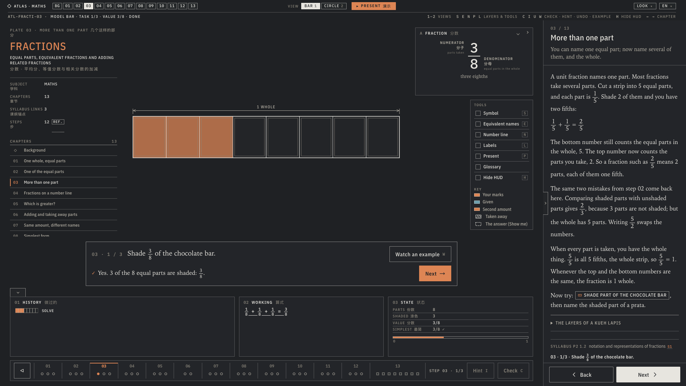

# Atlas

A bilingual (EN / 中文) interactive textbook for a Singapore primary school student. Three kinds of scene (engines):

- **Time**: watch history unfold on a map with a timeline (World War II, World War I).
- **Space**: take things apart in 3D and see how they work (an air conditioner, a grasshopper).
- **Lesson**: a step-by-step interactive lesson with practice, drawn as SVG models you shade, fold, cut and place (Fractions, aligned to the MOE 2021 syllabus).

Five topics are live: World War II, World War I, How an air conditioner works, A grasshopper's body and Fractions. Everything is bilingual, with sources recorded in each topic's `data/SOURCES.md`.

Content is plain MDX + JSON, rules-driven, no accounts and no external requests at runtime. Scene state lives in the URL (answers never do), so every view is a shareable link.

| Time (World War I) | Space (air conditioner) | Lesson (Fractions) |
|---|---|---|
|  |  |  |
|  |  |  |

Visual language adapted from the industrial-3d-showcase technical-plate skill. More frames (modes, Chinese, phone) are in [docs/screenshots/](docs/screenshots/).

## Stack

Astro 5 (static) · React 19 · Tailwind 4 · zustand · MapLibre GL (time scenes, offline GeoJSON basemap) · three.js + react-three-fiber (space scenes) · plain SVG (lesson scenes) · zod (build-time content validation) · vitest · Playwright · `@vite-pwa/astro` (installable, offline-capable). Deployed on Cloudflare Pages.

## Commands

Node >= 22, pnpm 9.

```bash
pnpm install
pnpm dev        # http://localhost:4321/  (no service worker in dev)
pnpm build      # validate content, then static build to dist/ (ATLAS_BASE=/sub/path for a sub-path)
pnpm preview    # serve dist/
pnpm check      # astro check + tsc
pnpm validate   # content validator (schemas, bilingual fields, ids, references)
pnpm test       # vitest unit tests
pnpm e2e        # Playwright smoke test against dist/ (pnpm build first; pnpm exec playwright install chromium once)
pnpm shoot sample-space --keys --layout   # screenshots + key/button sync + HUD layout QA (pnpm build first; see docs/06)
pnpm run deploy # build + `pnpm dlx wrangler pages deploy dist --project-name atlas`
```

## Docs

Design and engineering docs are in [docs/](docs/README.md). Start with [02-architecture](docs/02-architecture.md) and [06-dev-guide](docs/06-dev-guide.md) (adding a topic, the scene contract, URL parameters); deploying is in [07-deploy](docs/07-deploy.md).

## Licence

Code: MIT (`LICENSE`). Content and derived map data: CC BY-NC-SA 4.0 (`LICENSE-CONTENT`). Third-party data, maps, fonts and libraries: `THIRD-PARTY-NOTICES.md`.
